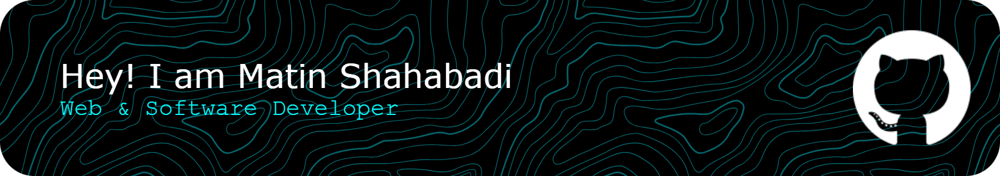

# Hi, I'm Matin Shahabadi 👋

**Web & Software Developer · Python · Django · Linux · Automation · Open Source**

## About

Web and software developer working with **Python**, **Django**, **JavaScript**, **Bash**, and **Linux**. I build backend systems, automation tools, bots, CLI utilities, and web applications. My work spans network optimization, Docker deployment, Telegram and Discord bots, and developer tooling. I care about clean code, practical solutions, and tools that work reliably in production.

## Currently Working On

- Backend systems and web application development
- Linux network optimization and infrastructure tooling
- Docker-based deployment and server automation
- Telegram and Discord bot development
- Developer tools and CLI utilities

## Tech Stack

## GitHub Analytics

&nbsp;&nbsp;

## Open Source Focus

- **Backend engineering** — Python services, APIs, and automation systems
- **Linux tooling** — network optimization, sysctl tuning, server utilities
- **DevOps** — Docker deployment, CI/CD, monitoring, and lifecycle management
- **Bots and automation** — Telegram and Discord bots, reporting tools, workflow automation
- **Developer tools** — CLI utilities, DNS management, release builders

## Development Philosophy

1. **Write code that works in production** — reliability beats cleverness
2. **Keep things reversible** — backup before you change, support rollback
3. **Make it idempotent** — running the same thing twice should not break anything
4. **Document what matters** — clear READMEs and comments save hours later
5. **Solve the real problem** — understand the root cause before writing code

## Connect

&nbsp;&nbsp;

&nbsp;&nbsp;

&nbsp;&nbsp;

&nbsp;&nbsp;

&nbsp;&nbsp;

&nbsp;&nbsp;

## Support

© 2026 **Matin Shahabadi** · Crafted with care from Iran

